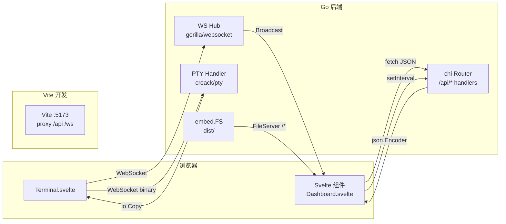

# Webux — Go 后端与 Svelte 前端交互概述

> 个人学习笔记，整理自对 webux 源码的阅读。

---

## 一、整体架构

```
浏览器 (Svelte)
    │
    ├── HTTP / JSON  ──► https://localhost:8989/api/*   (Go chi router)
    ├── WebSocket    ──► https://localhost:8989/ws       (事件推送 Hub)
    ├── WebSocket    ──► https://localhost:8989/ws/terminal (PTY 终端)
    └── 静态资源     ◄── embed.go 嵌入 dist/             (单页应用)
```

整个应用在**生产构建时打包成单个二进制**：前端静态文件通过 `//go:embed` 嵌入，后端同时提供 API 和 SPA 路由。

---

## 二、静态资源嵌入 —— Go 打包 Svelte 产物

### `cmd/webux/embed.go`

```go
package main

import "embed"

//go:embed dist
var webFS embed.FS
```

Go 编译器在编译时将 `cmd/webux/dist/` 目录**编译进二进制**。

### `main.go` 取出子目录

```go
webDist, err := fs.Sub(webFS, "dist")
```

### `router.go` 通配路由负责 SPA fallback

```go
r.Get("/*", func(w http.ResponseWriter, r *http.Request) {
    http.FileServer(http.FS(cfg.WebFS)).ServeHTTP(w, r)
})
```

**原理**:所有 `/api/*`、`/ws/*` 路径先被前面的路由匹配；任何未匹配的路由（如 `/#/dashboard`）落到通配符，返回 `index.html`，由 Svelte 客户端路由接管。

---

## 三、REST API（Svelte → Go 拉数据）

Svelte 组件用 `fetch` 调用 Go 的 JSON handler。

### Svelte 侧示例 —— `Dashboard.svelte`

```typescript
async function loadStats() {
  const res = await fetch('/api/system/stats');
  const d = await res.json();
  cpuPct  = d.cpu_percent ?? 0;
  memUsed = d.mem_used_human ?? fmtMB(d.mem_used_mb);
  // ...
}

onMount(() => {
  loadStats();
  const iv = setInterval(loadStats, 5000);  // 5s 轮询刷新
  return () => clearInterval(iv);
});
```

### Go 侧 handler —— `internal/api/handlers/system.go`

```go
func (h *SystemHandler) Stats(w http.ResponseWriter, r *http.Request) {
    stats, _ := collectStats()         // 读 /proc/stat、/proc/meminfo...
    w.Header().Set("Content-Type", "application/json")
    json.NewEncoder(w).Encode(stats)   // → cpu_percent, mem_used_human, ...
}
```

### 路由注册 —— `internal/api/router.go`

```go
r.Get("/api/system/stats", sysH.Stats)
```

### 认证机制

全局 middleware 检查 JWT Cookie，`/api/` 下所有路由都受保护（除 `/auth/*` 公开路由）。

---

## 四、WebSocket 实时推送（Go → Svelte）

### 中央 Hub —— `internal/ws/hub.go`

```go
type Event struct {
    Type    EventType   `json:"type"`      // "metric" | "cli_echo" | "log" | "alert"
    Payload interface{} `json:"payload"`
    SentAt  time.Time   `json:"sent_at"`
}

// Go 侧推送：广播到所有连接的客户端
hub.Broadcast(ws.EventCLIEcho, entry)
```

### Svelte 侧监听

```typescript
const ws = new WebSocket(`wss://${location.host}/ws`);
ws.onmessage = (e) => {
  const evt = JSON.parse(e.data);
  if (evt.type === 'cli_echo') {
    output += evt.payload.text;   // 实时显示 shell 输出
  }
};
```

---

## 五、WebSocket PTY 终端（双向通信）

### `internal/api/handlers/terminal.go`

每个终端用户启动一个独立 PTY 进程，通过 WebSocket 双工传输：

```go
conn, _ := termUpgrader.Upgrade(w, r, nil)
ptyWinch, ptyIO, _ := pty.Open()
go io.Copy(ptyWinch, conn)   // 浏览器 → PTY
go io.Copy(conn, ptyIO)      // PTY   → 浏览器
```

控制消息格式（JSON 文本帧）：
```json
{"type":"resize","cols":220,"rows":50}
{"type":"run","cmd":"df -h\n"}
```

Svelte 侧用 xterm.js 绑定（参考 `Terminal.svelte`）。

---

## 六、开发模式代理 —— Vite ↔ Go 分离运行

### `web/vite.config.ts`

```typescript
server: {
  port: 5173,
  proxy: {
    '/api': { target: 'https://localhost:8989', secure: false },
    '/ws':  { target: 'wss://localhost:8989',   ws: true, secure: false }
  }
}
```

- **开发时**：Vite dev server 跑在 `:5173`，服务 `index.html`；所有 `/api/*` 和 `/ws/*` 请求反向代理到 Go 后端 `:8989`
- **生产时**：两者合并为单一二进制，Vite 构建产物 embed 进 Go

---

## 七、关键文件索引

| 文件 | 职责 |
|------|------|
| `cmd/webux/embed.go` | `//go:embed dist` 嵌入前端 |
| `cmd/webux/main.go` | 启动 Go HTTP server（HTTPS :8989） |
| `internal/api/router.go` | chi 路由表，注册所有 /api/* 与 /ws/* |
| `internal/ws/hub.go` | WebSocket 事件总线（多客户端广播） |
| `internal/api/handlers/*.go` | 各业务 API handler |
| `web/src/App.svelte` | 根组件，hash 路由切换页面 |
| `web/src/routes/Dashboard.svelte` | 首页，展示系统 stats（5s 轮询） |
| `web/vite.config.ts` | Vite 构建配置 + 开发代理 |

---

## 八、数据流总图



---

## 九、构建流程关联

```
mise run web        → (cd web && nub install && nub run build)
                        ↓  cp -r web/dist cmd/webux/dist
mise run build      → go build -tags "mysql postgres" ./cmd/webux
                        embed.go 把 dist/ 编入二进制
mise run snapshot   → goreleaser 交叉编译 4 个目标平台
```
